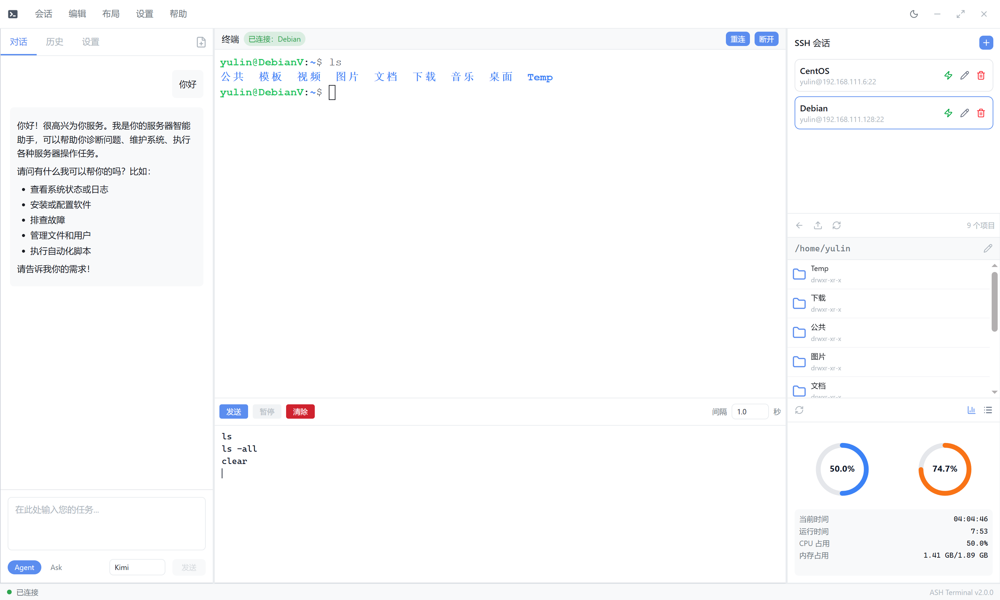
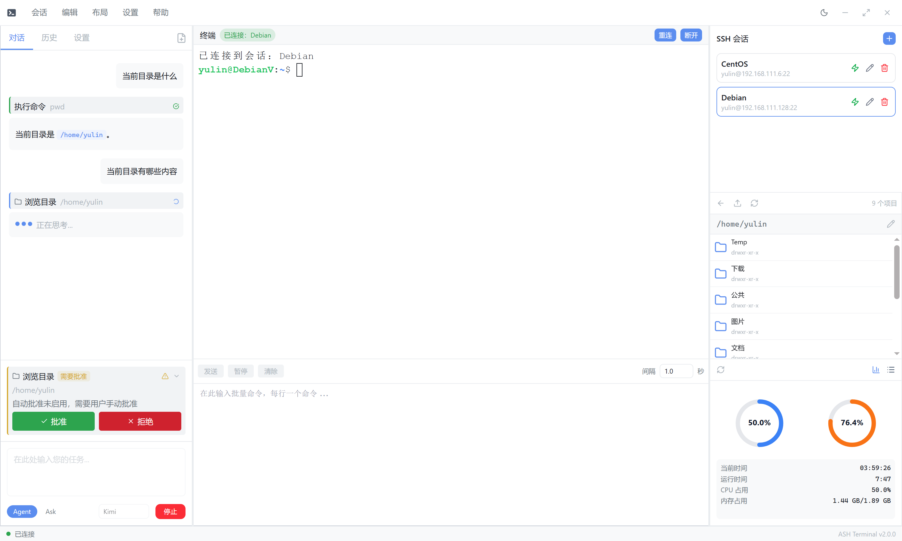
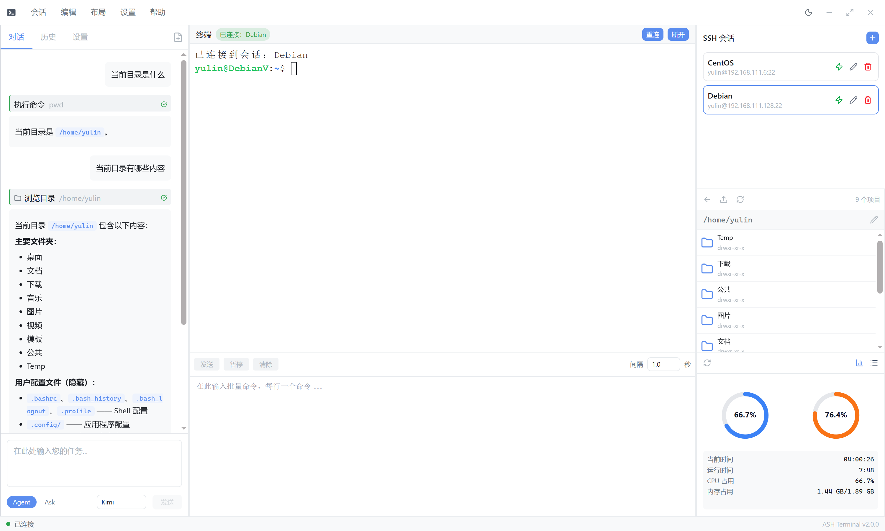
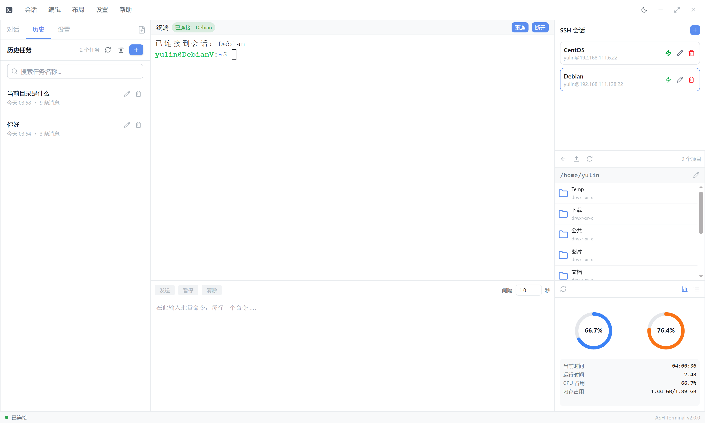
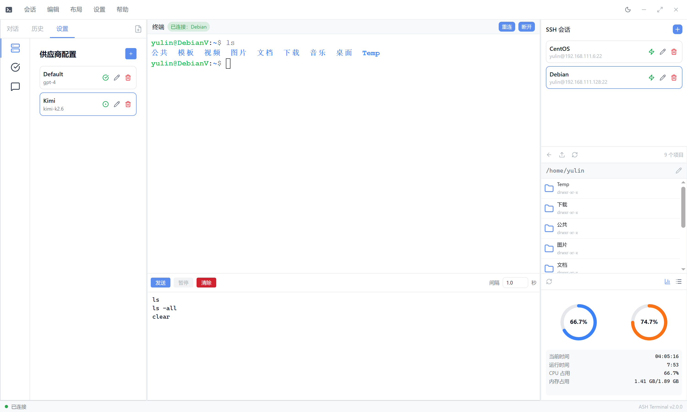
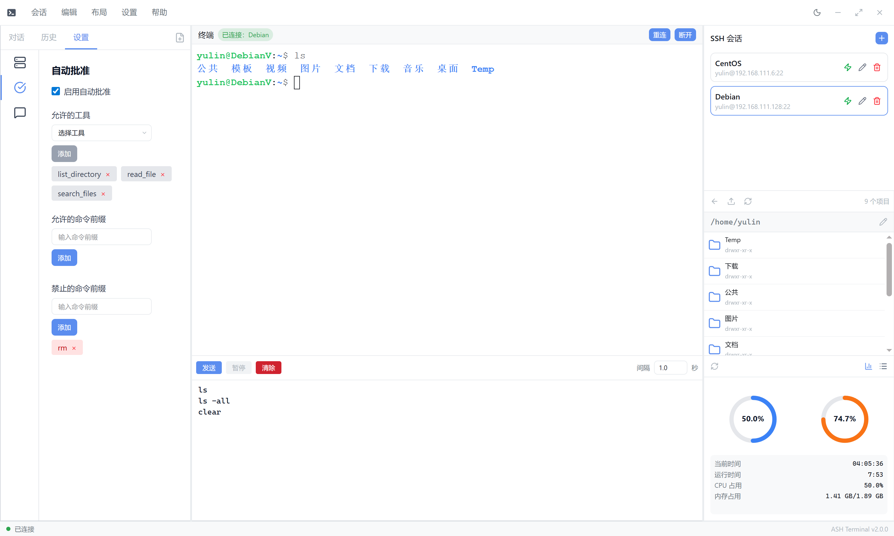
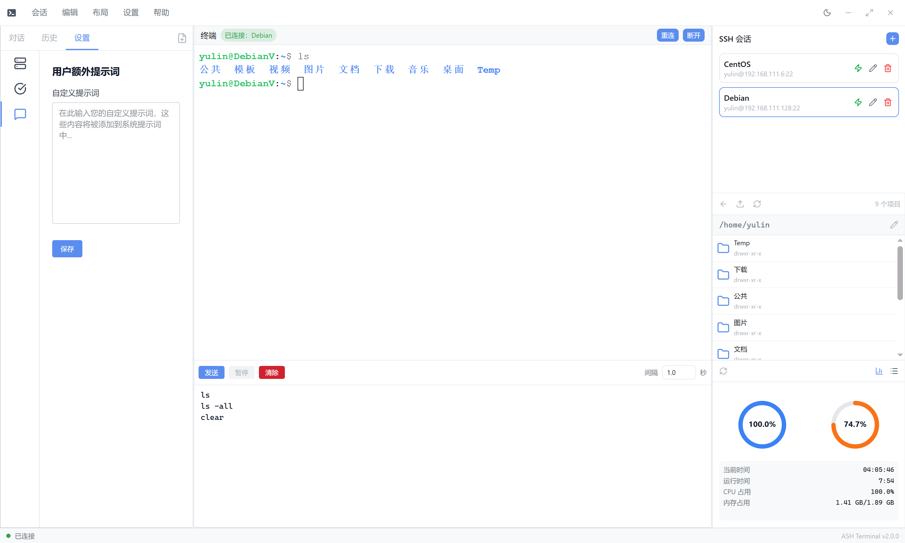
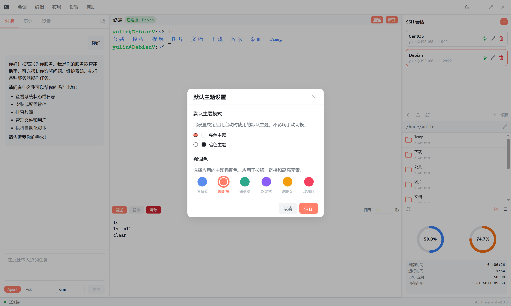
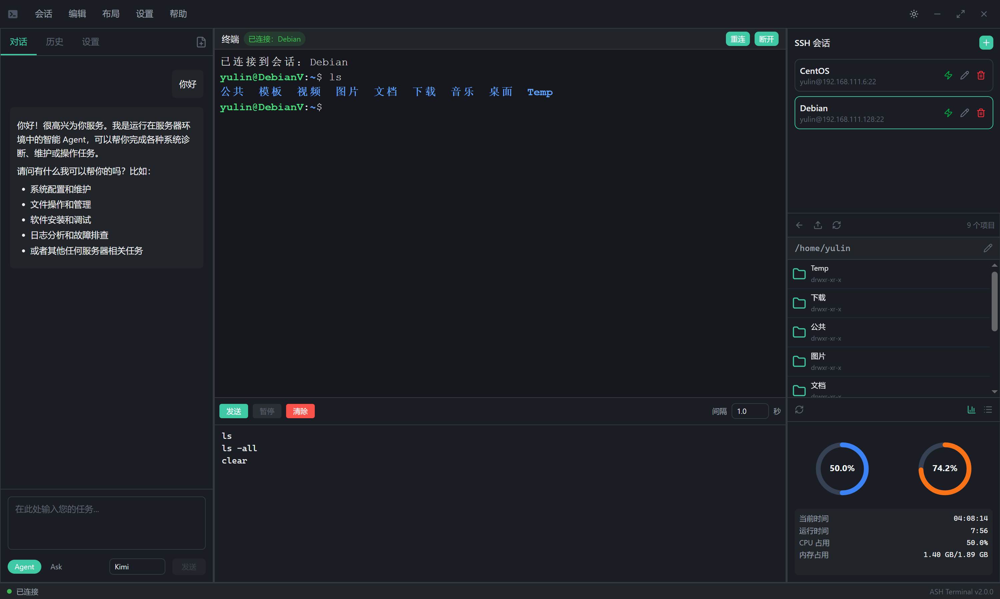

# AshTerminal

<div align="center">

一款现代化的智能 SSH 终端管理工具，集成 AI 助手，让服务器管理更高效、更智能。

[](package.json)
[](LICENSE)
[](https://www.electronjs.org/)
[](https://reactjs.org/)
[](https://www.typescriptlang.org/)
[](https://vitejs.dev/)
[](.github/workflows/)

</div>

## 运行效果

### 主界面



### AI 界面













### 主题色自定义



### 亮暗模式切换



## 特性

### 核心功能

- **多会话管理** - 同时管理多个 SSH 连接，支持密码和私钥认证
- **终端仿真** - 基于 xterm.js 5.3，完整支持 ANSI 转义序列和 256 色
- **文件管理** - 内置 SFTP 客户端，支持文件上传、下载、远程编辑和备份（支持修改前自动创建备份）
- **系统监控** - 实时监控远程服务器的 CPU、内存状态
- **批量执行** - 在多个 SSH 会话中按序批量执行命令，可配置执行间隔
- **快捷键面板** - 在菜单栏编辑中打开快捷键速查面板，集中查看所有键盘操作
- **灵活布局** - 左右侧栏可独立显示/隐藏，拖拽分隔条调整面板宽度

### AI 智能助手

- **AI Agent 模式** - 支持 Function Calling，可自动执行命令和操作文件
- **AI Ask 模式** - 纯问答模式，提供技术咨询和建议
- **丰富的工具集** - 命令执行（含 sudo）、文件读写（含创建和修改）、目录浏览、文件内容搜索（grep）共 7 个工具
- **Markdown 渲染** - AI 回复支持富文本 Markdown 渲染（基于 react-markdown + remark-gfm），代码块语法高亮（highlight.js）
- **工具调用可视化** - 工具调用过程以卡片形式展示，支持轮次分组和折叠展开
- **工具批准机制** - 支持自动批准、按需批准、全局禁用三种模式，规则优先级：黑名单 > 白名单 > 默认需批准，60 秒超时自动拒绝
- **任务管理** - 支持新建AI任务、清空会话任务、切换历史任务，自动记录 AI 对话和工具调用历史
- **结构化错误提示** - AI 调用异常分类展示，区分模型错误、网络错误、工具执行错误等

### 用户体验

- **主题切换** - 支持多种 DaisyUI 主题和强调色预设，明暗模式自由切换
- **配置持久化** - 自动保存会话配置、应用设置和面板布局状态
- **安全加密** - 敏感配置（API Key、SSH 密码）采用 AES-256-CBC 加密存储

## 技术栈

### 前端

- **框架**: React 19 + TypeScript 6.0 + Vite 7 (electron-vite 4)
- **状态管理**: Jotai - 原子化状态管理
- **UI 库**: DaisyUI 5 + TailwindCSS 4
- **终端**: xterm.js 5.3 + react-xterm
- **图标**: lucide-react
- **Markdown 渲染**: react-markdown + remark-gfm + rehype-highlight + rehype-sanitize + highlight.js
- **工具函数**: tailwind-merge, uuid

### 后端

- **运行时**: Electron 37 + Node.js 22
- **SSH**: ssh2 1.17 + ssh2-sftp-client
- **PTY**: node-pty
- **数据库**: Better-SQLite3 12（WAL 模式 + 外键约束）
- **配置**: electron-store + dotenv（编译时环境变量注入）
- **AI**: OpenAI SDK 6.x（支持兼容接口，Native JSON / XML 双协议）

## 项目结构

```
ash-terminal/
├── .github/
│   ├── workflows/
│   │   ├── release.yml             # Release 构建（推送 v* 标签触发）
│   │   └── test-build.yml          # Test 构建（推送 test-* 标签触发）
│   └── copilot-instructions.md     # Copilot 开发指南
├── build/                          # electron-builder 构建资源
├── resources/
│   └── icon.png                    # 应用图标
├── src/
│   ├── main/                       # Main Process (Node.js)
│   │   ├── index.ts                # 入口: 配置初始化 → 数据库 → IPC → 窗口
│   │   ├── ipc/                    # IPC 处理器（11 个模块）
│   │   │   ├── index.ts            # 统一注册入口
│   │   │   ├── window.ts           # 窗口控制
│   │   │   ├── config.ts           # 应用配置
│   │   │   ├── session.ts          # SSH 会话管理
│   │   │   ├── shell.ts            # 交互式 Shell
│   │   │   ├── file.ts             # 文件操作 / SFTP
│   │   │   ├── dialog.ts           # 系统对话框
│   │   │   ├── monitor.ts          # 系统监控
│   │   │   ├── aiConfig.ts         # AI 配置管理
│   │   │   ├── ai.ts               # AI 任务管理
│   │   │   └── toolApproval.ts     # 工具批准
│   │   └── lib/                    # 业务逻辑库
│   │       ├── SSHPool.ts          # SSH 连接池（Map<sessionId, SSH2Wrapper>）
│   │       ├── SSH2Wrapper.ts      # SSH 连接封装 (EventEmitter)
│   │       ├── ConfigManager.ts    # 明文配置管理 (electron-store)
│   │       ├── AiConfigStore.ts    # 加密配置管理 (AES-256-CBC)
│   │       ├── SessionStore.ts     # SSH 会话持久化
│   │       ├── Subscriptions.ts    # IPC 事件订阅管理
│   │       ├── WorkingDirectory.ts # PTY Shell 工作目录追踪
│   │       ├── ai/                 # AI 子系统
│   │       │   ├── AgentManager.ts # Agent 连接池
│   │       │   ├── TaskManager.ts  # 任务管理（面向前端的顶层接口）
│   │       │   ├── core/           # Agent 核心
│   │       │   │   ├── Agent.ts    # Agent 生命周期与对话循环
│   │       │   │   ├── Prompt.ts   # 系统提示词构建
│   │       │   │   └── AiErrorHandler.ts # AI 错误处理
│   │       │   ├── storage/
│   │       │   │   └── TaskStore.ts # SQLite 任务持久化
│   │       │   └── tools/          # AI 工具集（7 个工具 + 管理器）
│   │       │       ├── BaseTool.ts       # 工具基类
│   │       │       ├── ToolManager.ts    # 工具注册与批准管理
│   │       │       ├── toolHelpers.ts    # 工具辅助函数
│   │       │       ├── FileReadTool.ts   # 读取远程文件
│   │       │       ├── FileCreateTool.ts # 创建远程文件
│   │       │       ├── FileModifyTool.ts # 修改远程文件（带备份）
│   │       │       ├── FileSearchTool.ts # 文件内容搜索（grep）
│   │       │       ├── DirectoryTool.ts  # 浏览目录结构
│   │       │       ├── CommandTool.ts    # 执行普通命令
│   │       │       └── SudoCommandTool.ts # 执行 sudo 命令
│   │       └── database/           # 数据库层
│   │           ├── core/
│   │           │   ├── Database.ts # 数据库连接管理
│   │           │   └── Schema.ts   # 表结构定义
│   │           └── repositories/
│   │               └── TaskRepository.ts # 任务数据访问
│   ├── preload/                    # Preload Script (contextBridge)
│   │   ├── index.ts                # 暴露 6 个命名空间 API 到渲染进程
│   │   └── index.d.ts              # Window 接口类型声明
│   ├── renderer/                   # Renderer Process (React)
│   │   └── src/
│   │       ├── App.tsx             # 应用根组件
│   │       ├── main.tsx            # React 入口 (createRoot)
│   │       ├── components/         # React 组件库
│   │       │   ├── AppLayout.tsx    # 根布局（左侧栏 + 中央终端 + 右侧面板）
│   │       │   ├── TopBar.tsx       # 自定义窗口标题栏
│   │       │   ├── StatusBar.tsx    # 底部状态栏
│   │       │   ├── Splitter.tsx     # 面板拖拽分隔条
│   │       │   ├── CollapsiblePanel.tsx # 可折叠面板
│   │       │   ├── ConfigContext.tsx     # 配置上下文
│   │       │   ├── SheetModal.tsx   # 侧边滑出抽屉
│   │       │   ├── AiArea/          # AI 助手区域
│   │       │   │   ├── AiInterface.tsx     # AI 主布局
│   │       │   │   ├── AiTopBar.tsx        # AI 顶部控制栏
│   │       │   │   ├── AiChatView.tsx      # 聊天视图
│   │       │   │   ├── AiHistoryView.tsx   # 任务历史视图
│   │       │   │   ├── AiSettingsView.tsx  # AI 设置视图
│   │       │   │   ├── MarkdownRenderer.tsx # Markdown 渲染器
│   │       │   │   ├── ToolCallCard.tsx    # 工具调用卡片
│   │       │   │   ├── ToolCallGroup.tsx   # 工具调用分组
│   │       │   │   └── ToolApprovalCard.tsx # 工具批准卡片
│   │       │   ├── TerminalArea/    # 终端区域
│   │       │   ├── SessionManager/  # SSH 会话管理面板
│   │       │   ├── FileManager/     # 文件管理面板
│   │       │   ├── SystemMonitor/   # 系统监控面板
│   │       │   ├── BatchCommand/    # 批量命令面板
│   │       │   ├── Icon/            # 图标系统（lucide-react + 自定义 SVG）
│   │       │   ├── Button/          # 按钮组件
│   │       │   ├── Dropdown/        # 下拉菜单
│   │       │   ├── Modal/           # 弹窗组件集（会话/主题/布局/终端/监控/文件/快捷键/关于）
│   │       │   └── Toast/           # Toast 通知组件
│   │       ├── store/               # Jotai 状态管理（12 个原子文件）
│   │       │   ├── SessionStore.ts      # SSH 会话状态
│   │       │   ├── TaskStore.ts         # AI 任务状态
│   │       │   ├── ModalAtom.ts         # 弹窗模态控制
│   │       │   ├── ToastAtom.ts         # Toast 通知状态
│   │       │   ├── AreaAtom.ts          # 面板区域显示状态
│   │       │   ├── AiConfigAtom.ts      # AI 配置状态
│   │       │   ├── FileConfigAtom.ts    # 文件备份配置
│   │       │   ├── FileManagerAtom.ts   # 文件管理状态
│   │       │   ├── BatchCommandAtom.ts  # 批量命令状态
│   │       │   ├── MonitorStore.ts      # 系统监控状态
│   │       │   ├── Base.ts              # 基础状态
│   │       │   └── index.ts
│   │       ├── services/            # 服务层（封装 window.* API 调用）
│   │       │   ├── SSHService.ts        # SSH 操作服务
│   │       │   ├── AIService.ts         # AI 任务服务
│   │       │   ├── AiConfigService.ts   # AI 配置服务
│   │       │   ├── ContextService.ts    # 应用配置服务
│   │       │   ├── ElectronService.ts   # 窗口操作服务
│   │       │   └── ToolApprovalService.ts # 工具批准服务
│   │       ├── hooks/               # React Hooks
│   │       │   ├── SSH.ts               # SSH 操作 Hook
│   │       │   ├── SSHConnection.ts     # SSH 连接管理 Hook
│   │       │   ├── Config.ts            # 配置操作 Hook
│   │       │   ├── Theme.ts             # 主题切换 Hook
│   │       │   ├── BatchCommand.ts      # 批量命令 Hook
│   │       │   ├── Toast.ts             # Toast 通知 Hook
│   │       │   ├── ModalOpen.ts         # 弹窗控制 Hook
│   │       │   ├── useSplitter.ts       # 分隔条交互 Hook
│   │       │   ├── useAccentColor.ts    # 强调色 Hook
│   │       │   ├── AreaClosed/          # 面板折叠状态
│   │       │   └── Initialize/          # 初始化逻辑
│   │       └── utils/                # 工具函数
│   └── shared/                      # 共享代码（三进程共用）
│       ├── constants.ts              # 全局常量
│       ├── models/                   # 数据模型
│       │   ├── Session.ts            # SSH 会话模型
│       │   ├── AI.ts                 # AI 相关模型
│       │   ├── Task.ts               # 任务模型
│       │   ├── Config.ts             # 配置模型
│       │   ├── Monitor.ts            # 监控数据模型
│       │   ├── OpenAICompatible.ts   # OpenAI 兼容接口类型
│       │   ├── AiError.ts            # AI 错误类型
│       │   └── ToolParameter.ts      # 工具参数类型
│       └── types/                    # IPC API 函数签名
│           ├── SSH.ts                # SSH 操作类型
│           ├── Context.ts            # 应用配置类型
│           ├── Electron.ts           # 窗口控制类型
│           ├── AiConfig.ts           # AI 配置类型
│           ├── Task.ts               # AI 任务类型
│           └── ToolApproval.ts       # 工具批准类型
├── electron.vite.config.ts         # electron-vite 构建配置
├── electron-builder.yml            # electron-builder 打包配置
├── package.json
├── tsconfig.json                   # TypeScript 基础配置
├── tsconfig.node.json              # Main/Preload 进程配置
├── tsconfig.web.json               # Renderer 进程配置
├── .env.example                    # 环境变量模板
└── LICENSE                         # MIT 许可证
```

## 安装

### 环境要求

- Node.js >= 18
- Yarn >= 1.22

### 克隆仓库

```bash
git clone https://github.com/Grealin/ash-terminal.git
cd ash-terminal
```

### 安装依赖

```bash
yarn install
```

### 配置环境变量

创建 `.env` 或 `.env.local` 文件（用于 AI 配置加密）：

```bash
# 复制模板文件
cp .env.example .env
```

在 `.env` 中填入实际值：

```env
SECRET_KEY=your-secret-key-here-min-32-characters
```

> **重要说明**:
>
> - `SECRET_KEY` 用于加密存储敏感配置（SSH 会话、AI API Key 等），建议使用至少 32 位的随机字符串
> - **编译时注入机制**：编译时会自动将 `.env` 中的值注入到代码中，编译后的应用无需 `.env` 文件即可运行
> - `.env.local` 优先级高于 `.env`，可用于本地覆盖配置
>
> **安全提示**:
>
> - 使用足够强的密钥（至少 32 位随机字符）
> - 不要在公开渠道分享编译配置
> - 每次重新编译时可以更换新的密钥

## 快速开始

### 开发模式

```bash
yarn dev
```

启动后支持 DevTools，支持热重载（HMR）。

### 构建生产版本

```bash
# Windows
yarn build:win

# macOS
yarn build:mac

# Linux
yarn build:linux
```

构建产物位于 `dist/` 目录。

如需调试构建产物，可使用解包构建：

```bash
yarn build:unpack
```

### CI/CD 构建

项目配置了 GitHub Actions 自动化构建工作流：

- **Release 构建** (`release.yml`): 推送 `v*` 版本标签触发，在 `windows-2022` runner 上执行完整构建流程（format + typecheck + lint + build），自动生成 Windows 安装包和便携版 ZIP，发布到 GitHub Release
- **Test 构建** (`test-build.yml`): 推送 `test-*` 测试标签触发，仅构建不发布，用于验证构建流程

### 代码质量检查

```bash
# TypeScript 类型检查（分别检查 node 和 web 进程）
yarn typecheck

# ESLint 检查
yarn lint

# Prettier 格式化
yarn format
```

## 使用指南

### 1. 创建 SSH 会话

1. 点击右侧 **SSH 会话** 的 **+** 按钮
2. 填写连接信息：
   - **名称**: 自定义会话名称
   - **主机**: SSH 服务器地址
   - **端口**: 默认 22
   - **用户名**: SSH 用户名
   - **认证方式**: 支持密码认证和私钥认证
     - **密码认证**: 直接填写密码
     - **私钥认证**: 填写私钥内容（分别支持文件路径和私钥文本，支持 OpenSSH 格式）
3. 创建成功后点击 **连接** 按钮

### 2. 配置 AI 助手

1. 点击右侧 **设置** 按钮
2. 进入 **AI供应商配置** 标签
3. 添加 Provider：
   - **Base URL**: `https://api.openai.com/v1` 或其他兼容接口
   - **API Key**: 你的 API Key
   - **Model**: 模型名称（如 `gpt-4`）
4. 配置工具批准规则（每次添加/修改后自动保存）：
   - **自动批准**: 开启后，在规则内匹配的操作无需手动确认
   - **允许的工具**: 如 `read_file`, `list_directory`
   - **允许的命令前缀**: 如 `ls`, `cat`, `pwd`, `echo`
   - **禁止的命令前缀**: 如 `rm -rf`, `dd if=`（黑名单优先级高于白名单）
   - **全局禁用自动批准**: 关闭后所有工具操作均需手动确认

### 3. 使用 AI 助手

1. 连接一个 SSH 会话
2. 切换到 **聊天** 组件
3. 选择模式：
   - **Agent 模式**: 可调用各种工具，AI 会自动分析并执行命令和文件操作
   - **Ask 模式**: 仅回答问题，不执行任何工具
4. 输入问题或任务，AI 会自动分析并给出回复（支持 Markdown 渲染和代码高亮）
5. 工具调用过程以卡片形式展示，支持折叠/展开查看详细输入输出
6. 可随时点击顶部 **新建任务** 开始新对话，或在历史任务中 **清空任务** 清除当前会话所有历史

### 4. 文件管理

1. 点击刷新加载远程文件列表
2. 浏览远程文件系统目录结构
3. 支持操作：
   - 上传文件（点击上传按钮，选择目标目录）
   - 下载文件（点击文件右侧下载按钮）
   - 删除文件（需确认）
   - 远程编辑（支持自动备份）

### 5. 系统监控

1. 点击刷新获取实时系统监控数据
2. 查看监控信息：
   - CPU 使用率
   - 内存使用情况
   - 运行时间

### 6. 应用外观与布局

1. 点击顶部菜单 **设置** 进入主题和外观配置
2. **主题切换**: 支持多种 DaisyUI 主题 + 强调色预设，明暗模式自由切换
3. **布局调整**: 左右侧栏可独立显示/隐藏，拖拽分隔条调整面板宽度

## 开发指南

### 进程间通信架构

项目采用标准 Electron 三层架构：

```
Renderer (React 19 + Jotai)   →   Preload (contextBridge)   →   Main Process (Node.js)
```

六个 Preload 命名空间：

| 命名空间              | 用途                           |
| --------------------- | ------------------------------ |
| `window.electron`     | 窗口控制（最小化/最大化/关闭） |
| `window.context`      | 应用配置读写                   |
| `window.ssh`          | SSH 操作与文件传输             |
| `window.aiConfig`     | AI 配置管理（Provider CRUD）   |
| `window.ai`           | AI 任务管理与事件监听          |
| `window.toolApproval` | 工具批准请求与响应             |

### 添加新的 IPC 功能

1. 在 `src/shared/types/` 定义函数类型签名
2. 在 `src/main/lib/` 实现业务逻辑
3. 在 `src/main/ipc/` 注册 `ipcMain.handle('channelName', ...)`
4. 在 `src/preload/index.ts` 对应命名空间中用 `ipcRenderer.invoke` 暴露 API
5. 更新 `src/preload/index.d.ts` Window 接口类型声明

### 添加新的 AI 工具

1. 在 `src/main/lib/ai/tools/` 创建工具类（继承 `BaseTool`）
2. 实现 `getDefinition()` 和 `execute(context, params)` 方法
3. 在 `src/main/lib/ai/tools/index.ts` 导出
4. 在 `ToolManager` 构造函数中注册工具

### 路径别名

Main Process 和 Renderer 使用不同的别名配置：

| 别名           | Main Process   | Renderer Process              |
| -------------- | -------------- | ----------------------------- |
| `@shared`      | `src/shared`   | `src/shared`                  |
| `@/lib`        | `src/main/lib` | --                            |
| `@/components` | --             | `src/renderer/src/components` |
| `@/hooks`      | --             | `src/renderer/src/hooks`      |
| `@/store`      | --             | `src/renderer/src/store`      |
| `@/services`   | --             | `src/renderer/src/services`   |

### 代码质量

项目使用 husky + lint-staged 确保代码质量：

- 提交前自动运行 ESLint 和 Prettier
- 提交信息建议完整明确
- CI 构建自动执行 typecheck 和 lint 检查，通过后才会完成构建

## 贡献

欢迎提交 Issue 和 Pull Request！

### 提交规范

项目使用 husky + lint-staged 确保代码质量：

- 提交前自动运行 ESLint 和 Prettier
- 提交信息建议完整明确

### 开发流程

1. Fork 本仓库
2. 创建特性分支 (`git checkout -b feature/amazing-feature`)
3. 提交更改 (`git commit -m 'Add some amazing feature'`)
4. 推送到分支 (`git push origin feature/amazing-feature`)
5. 创建 Pull Request

## 许可证

本项目基于 [MIT License](LICENSE) 开源。

## 免责声明

### 使用风险

- **风险自负**: 使用本软件即表示您同意自行承担所有风险。开发者不对因使用本软件造成的任何直接或间接损失负责。
- **数据安全**: 虽然本软件对敏感配置（SSH 密码、API Key 等）采用 AES-256-CBC 加密存储，但请您务必：
  - 定期备份重要数据
  - 不要在不可信的环境中运行本软件

### AI 功能声明

- **工具执行**: AI Agent 模式可自动执行命令和操作文件，请务必：
  - 仔细配置工具批准规则
  - 审查 AI 发起的危险操作（如删除、修改系统文件）
  - 不要在生产环境中轻易启用自动批准
- **内容准确性**: AI 生成的内容和建议仅供参考，可能存在错误或不适用的情况，请结合实际情况判断。
- **API 使用**: 使用第三方 AI 服务（如 OpenAI）时，您需遵守其服务条款和使用政策。

### 合规使用

- **授权访问**: 仅对您拥有合法访问权限的服务器使用本软件。
- **法律责任**: 不得将本软件用于任何非法用途，包括但不限于：
  - 未经授权访问他人系统
  - 破坏或篡改数据
  - 其他违反当地法律法规的行为
- **隐私保护**: 尊重他人隐私，不得使用本软件收集、传播未经授权的敏感信息。

### 无担保声明

本软件"按原样"提供，不提供任何明示或暗示的担保，包括但不限于：

- 适销性担保
- 特定用途适用性担保
- 不侵权担保
- 持续可用性和稳定性担保

开发者不保证软件无错误、无中断或满足所有用户需求。

### 第三方服务

本软件集成或依赖的第三方服务（SSH 服务器、AI API 提供商等）由各自的服务提供商负责，开发者不对第三方服务的可用性、安全性或内容负责。

---

**如您使用本软件，则默认同意以上免责条款。**

## 致谢

- [Electron](https://www.electronjs.org/)
- [React](https://reactjs.org/)
- [Vite](https://vitejs.dev/)
- [xterm.js](https://xtermjs.org/)
- [ssh2](https://github.com/mscdex/ssh2)
- [OpenAI](https://openai.com/)
- [DaisyUI](https://daisyui.com/)
- [TailwindCSS](https://tailwindcss.com/)
- [Jotai](https://jotai.org/)
- [lucide-react](https://lucide.dev/)
- [highlight.js](https://highlightjs.org/)
- [Better-SQLite3](https://github.com/WiseLibs/better-sqlite3)
